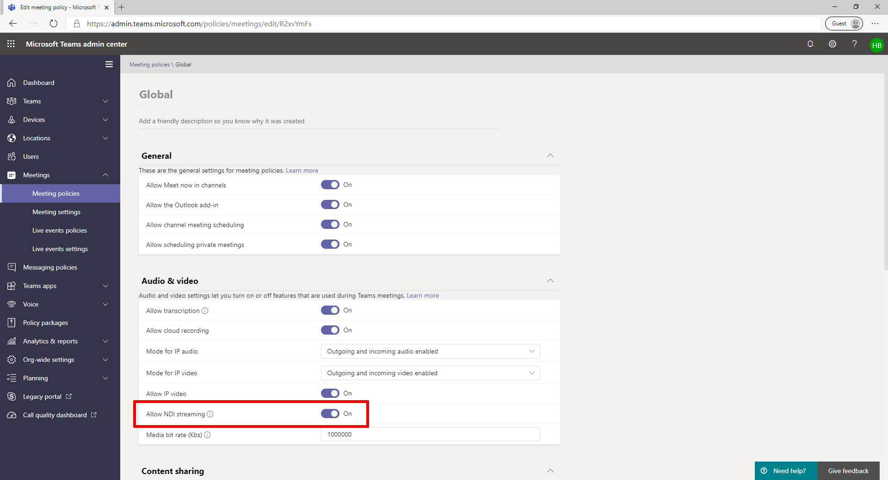
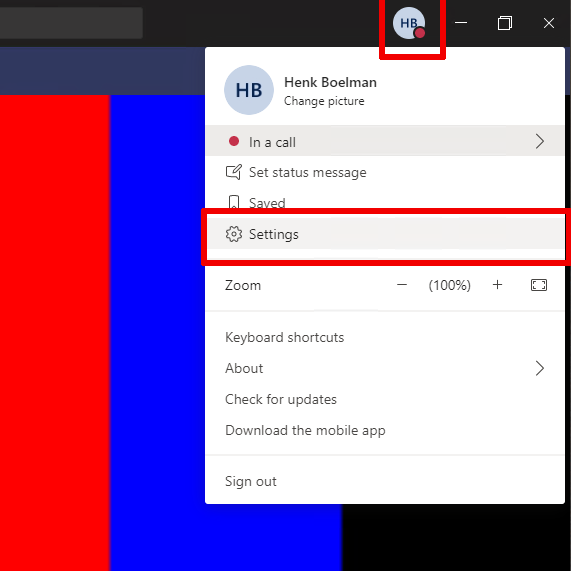
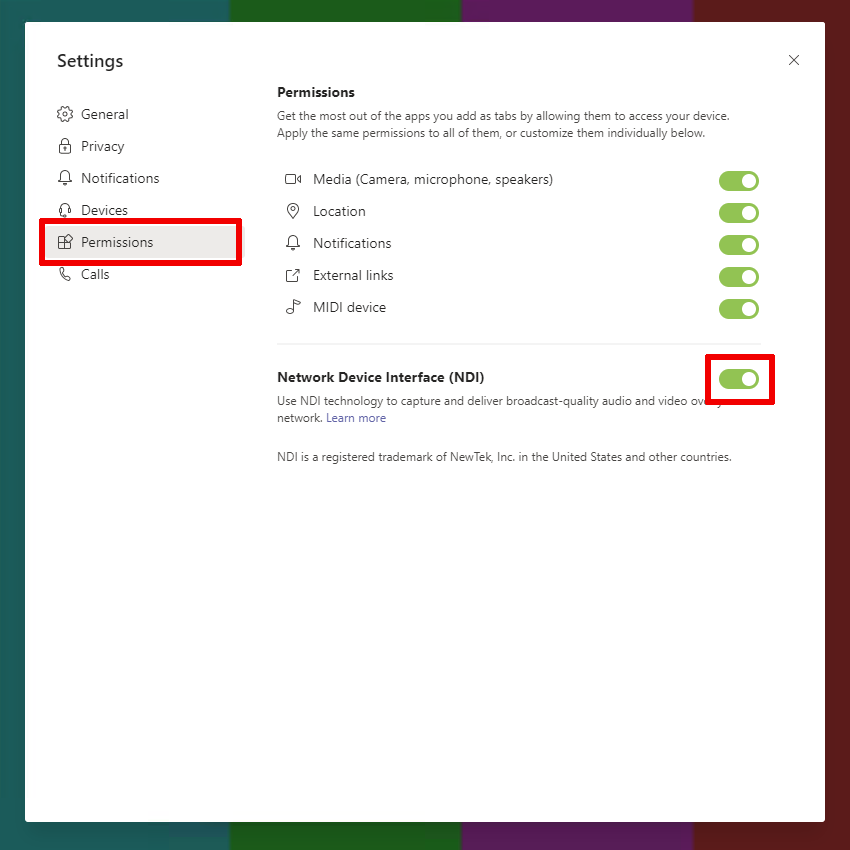
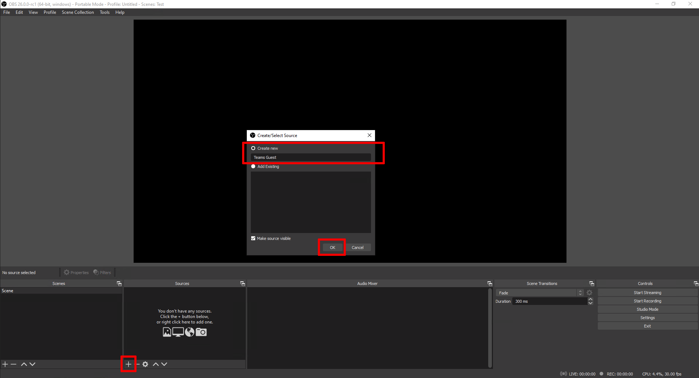
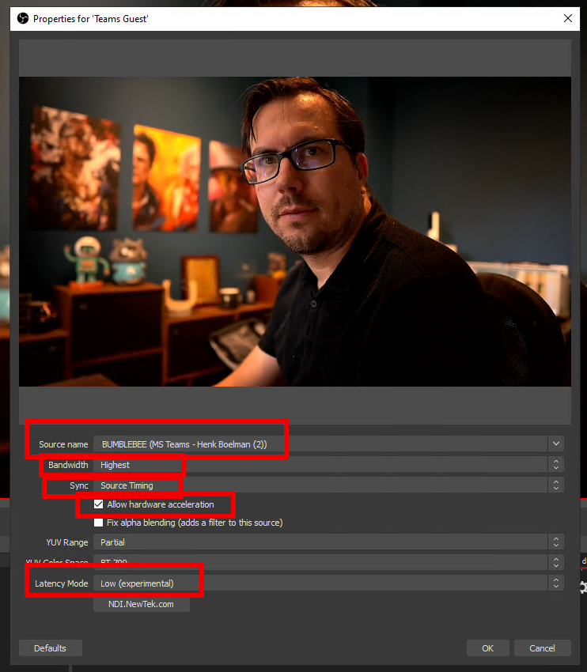
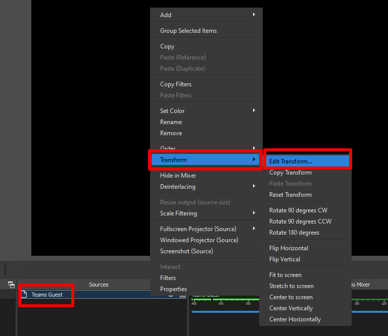
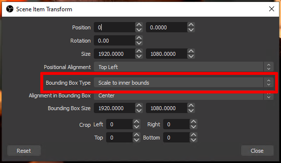
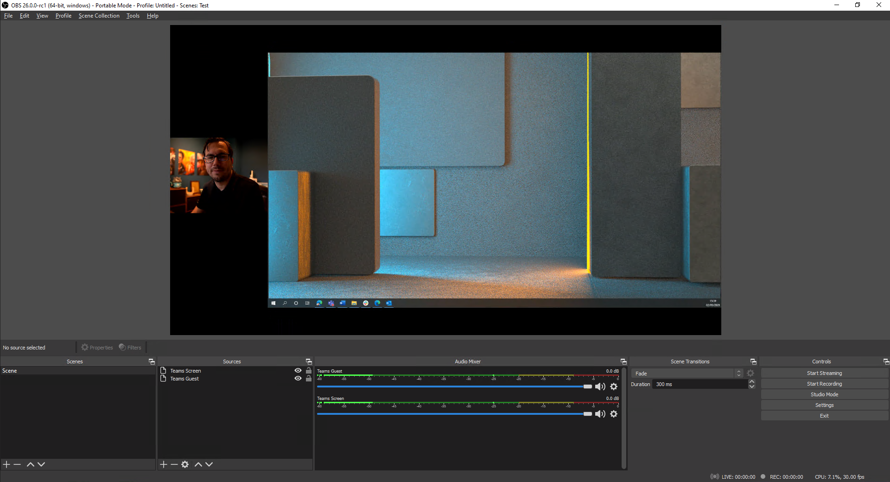

# Online events with Teams NDI and OBS

A few weeks ago the NDI feature in Teams became publicly available. This is great news and gives event organizers the opportunity to use Teams as a conversation platform and use other tool, like OBS of vMix to manage and brand the output and stream it to a platform of their choosing like YouTube or Vimeo.

> [Learn more](https://www.ndi.tv/) about NDI

## Enable NDI in Teams
To make NDI available for users to use an administrator has to enable this in a Teams Policy and the user has to enable it in the Teams Client.

### Enable NDI in the Meeting Policy
The path below shows how to enable this for everyone in the organization. *(Your Teams admin will know how to implement this for a smaller group)*

- Open the Microsoft Teams admin center 
https://admin.teams.microsoft.com/
- Navigate to Meetings > Meeting policies
- Click on the 'Global' (Org-wide default)

- In the Global Policy switch 'Allow NDI streaming' on.

> [Read more](https://docs.microsoft.com/en-US/microsoftteams/meeting-policies-in-teams?WT.mc_id=teamsndi-blog-heboelma#bkaudioandvideo) about Managing meeting policies.

Enabling the policy can take a few hours.

### Enable NDI in the Teams Client
When the policy is enabled every user has to activate NDI in settings, before a call is started. You cannot enable NDI during a call.

To enable to policy open settings.
- Click on the profile image in the top right
- Click on settings

- Open the Permissions settings
- Switch the "Network Device Interface (NDI)" on

### Tips & Tricks
- The video quality improves if nobody shares a screen.
- You want to set the Media bit rate in the policy to 10 Mbs to get better video quality.

-------------- 

## Get the Teams NDI in OBS
In this part we will go through the minimal steps that are needed to get the Teams NDI output in an OBS Scene.

### Install OBS with NDI support
- [Download](https://obsproject.com/) and install OBS
- [Download](https://github.com/Palakis/obs-ndi/releases) and install the OBS NDI Plugin

### Setup a NDI Source in OBS
In this section we are going to create a scene in OBS with NDI source from a Team Meeting.

- First you have to start a Team Meeting with at least one guest.
- Create a new NDI Source in OBS
  - Click the + icon under sources
  - Select "Create new"
  - Enter a name like "Teams Guest"
  - Click OK

- Configure the properties
    - Source name: Select the NDI Source from MS Team
    - Bandwidth: Select Highest
    - Sync: Select Source Timing (this syncs the audio / video)
    - Check Allow hardware acceleration (this will use your GPU if available)
    - Latency Mode: Select Low (With low there is almost no delay)

### Configuring the NDI Source
A feature in Teams is that the video adjust to the bandwidth available. This means in OBS that the resolution of the NDI source can change during a broadcast. Also the resolution of the video scales down if a screen is sharing. 
This results in the unwanted behavior that the source is getting bigger and smaller all the time. To avoid this you want to lock the size of the source and let the video scale to the inner bounds of the source.

- Right click on the source
- Expand Transform
- Select 'Edit Transform'

- Change the 'Bounding Box Type' to 'Scale to inner bounds'
- Click close to save

You can repeat this steps to add more sources for other speakers and a screen share.

### Tips & Tricks
- **Audio**
For every person in Teams you get an individual NDI Feed. A good thing to know is that in that NDI feed is:
 - The video of the person (Changeable resolution)
 - The audio stream of the whole Teams conversation.

> So don't forget, in OBS you can always hear everything that is going on in the Team conversation.

## Continue learning:
- [Everything about Teams on Microsoft Docs](https://docs.microsoft.com/en-us/MicrosoftTeams/?WT.mc_id=teamsndi-blog-heboelma)
- [Microsoft Teams Learning Paths](https://docs.microsoft.com/en-us/learn/browse/?WT.mc_id=teamsndi-blog-heboelma&expanded=m365&filter-products=teams&products=office-teams)
- [Online meetups with OBS and Skype](https://www.henkboelman.com/articles/online-meetups-with-obs-and-skype/)
- [Provisioning Azure VM as a Streamer Machine with Chocolatey](https://dev.to/azure/provisioning-azure-vm-as-a-streamer-machine-with-chocolatey-2pha)
- [Streaming a Community Event on YouTube](https://blog.maartenballiauw.be/post/2020/04/02/streaming-a-community-event-on-youtube-sharing-the-technologies-and-learnings-from-virtual-azure-community-day.html)